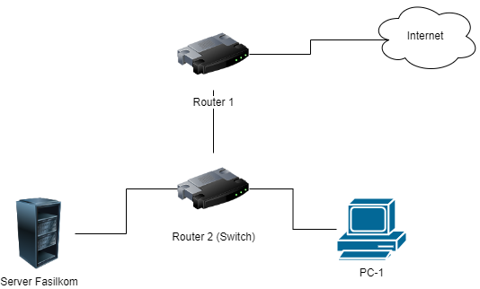

# Universitas Esa Unggul Kampus Tangerang
# UAS Jaringan Komputer Lanjut
## Kelompok 4 
1. Dian Fajar Septianto (20200801194)
2. Luri Sesy Apriyani (20200801155)
3. Yohanes Bagas Ari Widatama (20200801179)

## Router 1 
- Config exported file : router-config-kel4.rsc
- Config backup file : MikroTik-20240126-0259.backup
## Router 2 Mikrotik sebagai Switch
- Config exported : switch-config-kel4.rsc
- Config backup file : MikroTik-20240126-0237.backup

## Topology

  

## Penjelasan

### Router (RB941-2nD):

- **Wireless Configuration:**
  - SSID untuk jaringan nirkabel disetel sebagai "MikroTik".

- **VLAN Configuration:**
  - VLAN dengan ID 99 ditambahkan pada antarmuka `ether4`.

- **Wireless Security Profiles:**
  - Profil keamanan nirkabel default disetel dengan identitas supplicant "MikroTik".

- **IP Pool dan DHCP Server:**
  - Sebuah pool DHCP dengan nama "dhcp_pool0" dan rentang alamat IP `192.168.99.2-192.168.99.254` dibuat.
  - Sebuah server DHCP (`dhcp1`) ditetapkan pada antarmuka `ether4` dengan menggunakan pool DHCP tersebut.

- **IP Address:**
  - Alamat IP `192.168.99.1/24` ditetapkan pada antarmuka `ether4`.

- **DHCP Client:**
  - DHCP Client diaktifkan pada antarmuka `ether1`.

- **Firewall NAT:**
  - Rule NAT ditambahkan untuk melakukan masquerade (NAT) pada paket keluar dari router.

### Switch (RouterBOARD 941-2nD):

- **Bridge Configuration:**
  - Sebuah bridge (`bridge1`) dibuat dengan opsi `vlan-filtering=yes` dan `ingress-filtering=yes`.

- **Wireless Configuration:**
  - SSID untuk jaringan nirkabel disetel sebagai "MikroTik".

- **VLAN Configuration:**
  - VLAN dengan ID 99 ditambahkan pada `bridge1`.

- **Ethernet Switch Configuration:**
  - `Mirror-target` diatur ke `ether1`.
  - Konfigurasi switch port dilakukan untuk beberapa port (`ether1`, `ether2`, `ether3`, `ether5`):
    - Port `ether1` diatur sebagai `default-vlan-id=1` dan `vlan-header=always-strip`.
    - Port `ether2` diatur dengan `default-vlan-id=11`.
    - Port `ether3` diatur dengan `default-vlan-id=12`.
    - Port `ether5` diatur dengan `default-vlan-id=99`.

- **Bridge Port Configuration:**
  - Interface `ether1` ditambahkan sebagai bagian dari `bridge1`.
  - Interface `ether2` dan `ether3` ditambahkan ke `bridge1` dengan konfigurasi untagged pada VLAN yang sesuai (`pvid=11` untuk `ether2` dan `pvid=12` untuk `ether3`).

- **Bridge VLAN Configuration:**
  - Konfigurasi VLAN ditetapkan untuk memetakan port untagged dan tagged pada `bridge1` untuk VLAN tertentu.
  - `Bridge1` pada `ether1` ditag ke VLAN 99.
  - `Ether2` dan `ether3` ditetapkan sebagai untagged pada VLAN 11 dan VLAN 12, masing-masing.

- **Ethernet Switch VLAN Configuration:**
  - Setiap port diatur untuk mengaktifkan VLAN yang sesuai.

- **System Clock Configuration:**
  - Zona waktu diatur sebagai "Asia/Jakarta".

